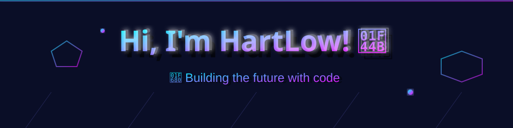

# 👨‍💻 HartLow (LO VAN PHAT) - Full-Stack Developer

<div align="center">


**Full-Stack Developer | AI Enthusiast | Game Developer**

[](https://github.com/LvPhat2004)
[](https://facebook.com/100070863624856)
[](mailto:lvphat10092k4@gmail.com)


</div>

---

## 🎯 About Me

Fourth-year IT student at **University of Transport and Communications** specializing in AI-powered applications, enterprise web solutions, and interactive game systems. 

**Latest Achievement**: Intelligent Virtual Admission Assistant with AI chatbot and voice interaction capabilities for UTC.

**Portfolio**: 33+ completed projects including 7 premium games and 26 web/AI/mobile applications.

---

## 🛠 Technical Skills

<div align="center">


</div>

### Frontend Development
- **Languages**: HTML5, CSS3, JavaScript, TypeScript
- **Frameworks**: React Native, Bootstrap
- **UI/UX**: Responsive Design, SVG Animations, Canvas API

### Backend Development
- **Languages**: Node.js, Python
- **Frameworks**: Express.js, Flask
- **API**: RESTful APIs, Real-time Communication

### Database & Storage
- **NoSQL**: MongoDB, SQLite
- **SQL**: SQL Server, Sequelize ORM
- **Data Modeling**: Schema Design, Optimization

### AI & Machine Learning
- **Platforms**: Google Gemini API
- **Technologies**: NLP, Chatbot Development
- **Speech**: Text-to-Speech (TTS), Web Speech API

### Game Development
- **Engines**: Custom 3D Raycasting, Three.js
- **Graphics**: HTML5 Canvas, WebGL
- **Systems**: Physics Engines, AI Pathfinding (A*)

### Mobile Development
- **Framework**: React Native
- **Platforms**: iOS & Android
- **Features**: Cross-platform UI, Native APIs

### Tools & Workflow
- **Version Control**: Git, GitHub
- **IDE**: Visual Studio Code
- **Testing**: Postman, Browser DevTools
- **Package Manager**: npm, pip

---

## 🚀 Featured Projects

<div align="center">


</div>

### 🤖 **UTC Virtual Admission Assistant** (2025)
Intelligent virtual assistant with AI chatbot and voice interaction for university admission support.
- **Technologies**: Node.js, NLP, Web Speech API, PWA
- **Features**: 
  - Natural language understanding
  - Voice input/output
  - Real-time responses
  - Admission information database
- **Live Demo**: [hartlow.github.io/TroLyUTCBot/talk.html](https://hartlow.github.io/TroLyUTCBot/talk.html)

### 🤖 **HartAI Platform** (2024)
AI assistant platform with Google Gemini integration and image generation capabilities.
- **Technologies**: Google Gemini, Node.js, MongoDB
- **Features**:
  - Multi-modal AI conversations
  - Image generation
  - Context-aware responses
  - User session management
- **Live Demo**: [hartlow.github.io/HartAI](https://hartlow.github.io/HartAI)

### 🎮 **Premium Games Collection** (2023-2024)

#### **Chicken Invaders** - Space Combat Game
- 8 different AI enemy types with unique behaviors
- Physics-based projectile system
- Power-up system and boss battles
- 2,600+ lines of optimized code

#### **3D Dungeon Explorer** - First-Person Adventure
- Custom raycasting engine (no external 3D libraries)
- A* pathfinding algorithm for enemies
- Dynamic lighting and texture mapping
- 960+ lines of pure JavaScript

#### **Solar System Simulator** - Educational Astronomy
- Real-time planetary motion using Three.js
- Accurate orbital mechanics
- Interactive camera controls
- Educational information panels

#### **Quiz Platform** - "Ai Là Triệu Phú"
- 100+ trivia questions
- Progressive difficulty system
- Sound effects and animations
- Score tracking and leaderboard

### 💼 **Enterprise Applications** (2022-2024)

#### **Learning Management System (LMS)**
- Admin and student portals
- Course management and enrollment
- Assignment submission and grading
- Real-time notifications

#### **E-commerce Platform**
- Product catalog with search/filter
- Shopping cart and checkout
- Payment gateway integration
- Order tracking system

#### **Product Management API**
- RESTful API with full CRUD operations
- Authentication and authorization
- Data validation and error handling
- API documentation

---

## 🎓 Education

<div align="center">


</div>

**University of Transport and Communications** | 2022 - 2026  
*Bachelor's Degree in Information Technology (Expected)*

**Self-Taught Learning Journey** | 2023 - 2024
- Full-Stack Web Development (Node.js, React)
- Game Development & 3D Graphics Programming
- AI/ML Integration and Chatbot Development
- Mobile App Development with React Native

---

## 📊 GitHub Stats

<div align="center">


</div>

```
📦 Projects: 33+ (7 games + 26 web/AI/mobile apps)
💻 Lines of Code: 50,000+
🌐 Languages: Vietnamese (Native), English (B1)
⚡ Experience: 3+ years of development
🎯 Specialization: Full-Stack, AI, Games
```

<div align="center">


</div>

---

## 🎯 What I Do Best

<div align="center">


</div>

✅ **Custom 3D Game Engines** - Building raycasting engines from scratch  
✅ **AI Chatbots** - NLP with voice interaction capabilities  
✅ **Full-Stack Web Apps** - End-to-end application development  
✅ **Cross-Platform Mobile** - iOS & Android with React Native  
✅ **Enterprise APIs** - Scalable backend systems with databases  
✅ **Performance Optimization** - Achieving smooth 60fps experiences

---

## 🔧 Current Focus

- 🌱 Learning advanced AI/ML techniques
- 🚀 Exploring WebGL and advanced 3D graphics
- 🤖 Building more intelligent chatbot systems
- 📱 Developing cross-platform mobile applications
- 🎮 Creating immersive game experiences

---

## 📬 Let's Connect!

<div align="center">



I'm always open to discussing new projects, creative ideas, or opportunities to collaborate!

[](https://github.com/LvPhat2004)
[](https://facebook.com/100070863624856)
[](mailto:lvphat10092k4@gmail.com)

---


*Last Updated: October 2025*

**⭐ If you find my projects interesting, please consider giving them a star!**

</div>
