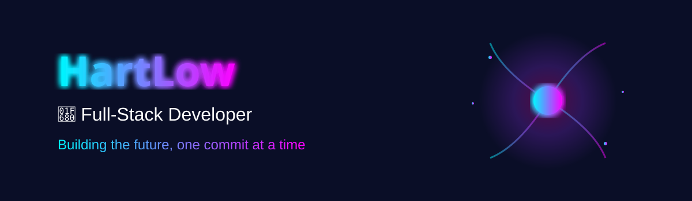
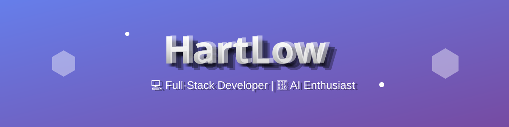
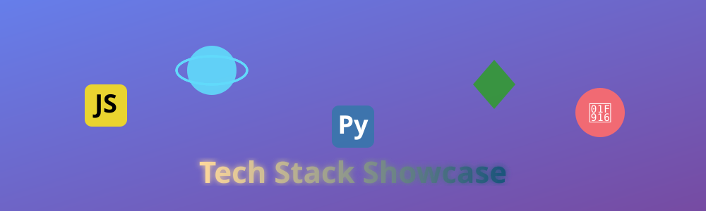

# 👋 Hi there, I'm HartLow!<div align="center"><div align="center">


<div align="center">


<!-- Main Banner with Earth Rotation & Shooting Stars --><h1 align="center">


[](https://github.com/HartLow)    ## 🎨 Visual Gallery


</div>


---<!-- Social Links --><div align="center">


## 🚀 About Me[](https://github.com/HartLow)


[](https://facebook.com/100070863624856)


```javascript[](mailto:lvphat10092k4@gmail.com)

const hartlow = {

  name: "HartLow",<br/><br/>

  role: "Full-Stack Developer",

  location: "Hanoi, Vietnam 🇻🇳",

  education: "University of Transport and Communications",

  year: "4th Year IT Student",

  passion: ["AI", "Game Dev", "Web Dev"],

  learning: ["AI/ML", "Cloud Computing"]<!-- GitHub Trophy -->

};

```<br/><br/>


**💼 What I Do:**

- 💻 Full-Stack Developer

- 🤖 AI Integration Specialist (Google Gemini)</div>

- 🎮 Game Engine Architect

- 🚀 33+ Completed Projects


**🎓 Education:**---<br/><br/>

- 📚 IT Student (2022-2026)

- 🏫 University of Transport and Communications


<br clear="right"/>## 🚀 About Me


---


## 🛠️ Tech Stack<br/><br/>


**Languages:**```javascript


const hartlow = {


  name: "HartLow",</div>


  role: "Full-Stack Developer",


**Frontend:**  location: "Hanoi, Vietnam 🇻🇳",---


  education: "University of Transport and Communications",


  yearOfStudy: "4th Year IT Student",## 🛠️ Tech Stack-banner.svg" alt="HartLow Space Intro"/>


**Backend:**  passion: ["AI", "Game Development", "Web Development"],</h1>


  currentlyLearning: ["Advanced AI/ML", "Cloud Computing"],


  funFact: "Built custom 3D game engines from scratch! 🎮"</div>


**Database:**};


```<br/>


**AI & Tools:**### 💼 Professional Identity<div align="center">


- 💻 **Full-Stack Developer** specializing in modern web technologies[](https://github.com/HartLow)


---- 🤖 **AI Integration Specialist** with Google Gemini & NLP experience[](https://facebook.com/100070863624856)


## 🎮 Featured Projects- 🎮 **Game Engine Architect** with custom 3D rendering capabilities[](mailto:lvphat10092k4@gmail.com)


### 🤖 AI & Chatbot- 🚀 **Problem Solver** with 33+ completed projects


| Project | Tech Stack | Features |

|---------|-----------|----------|

| **[UTC Virtual Admission Assistant](https://hartlow.github.io/TroLyUTCBot/talk.html)** | Node.js, NLP, Web Speech API | 🎙️ Voice interaction, 🤖 NLP, 🎨 Character animations |### 🎓 Education

| **[HartAI Platform](https://hartlow.github.io/HartAI)** | Google Gemini AI, Node.js, MongoDB | 🤖 AI assistant, 🖼️ Image generator, 💬 Real-time chat |

</div>

### 🎮 Game Development

- 📚 Bachelor's in Information Technology (2022-2026)

| Project | Lines | Tech Stack | Highlights |

|---------|-------|-----------|------------|- 🏫 University of Transport and Communications, Hanoi<br/>

| **3D Dungeon Explorer** | 960 | Custom Raycasting Engine | 🎨 Built from scratch, 🧮 3D rendering, 🤖 AI pathfinding |

| **Chicken Invaders** | 2600 | JavaScript, Canvas API | 🎮 8 enemy types, ⚡ 20-level weapons, 🎯 60fps |- 🌟 Focus: Software Development, AI Integration, System Architecture

| **Solar System Simulator** | 1200 | Three.js, WebGL | 🌍 Real-time astronomy, 🪐 Orbital mechanics |

| **Ai Là Triệu Phú Quiz** | 800 | JavaScript, HTML5 | ❓ 100+ questions, 🎨 TV UI, 🏆 Leaderboards |<p align="center">


### 💼 Enterprise Web Apps<br clear="right"/>  


| Project | Tech Stack | Features |</p>

|---------|-----------|----------|

| **Learning Management System** | React Native, Node.js, MongoDB | 👨‍🎓 Student Portal, 👨‍🏫 Instructor Tools, 📊 Analytics |---

| **E-commerce Platform** | Node.js, Express.js, SQL | 🛒 Shopping Cart, 💳 Payment, 📦 Tracking |

| **Product Management API** | Python Flask, SQLAlchemy | 🔧 REST API, 🔐 Auth, 📝 Docs |---


---## 🛠️ Tech Stack


## 📊 Stats## � About Me


```<div align="center">

📦 Total Projects: 33+

├─ 🤖 AI Applications: 5

├─ 🎮 Premium Games: 7

├─ 💼 Web Applications: 12

├─ 📱 Mobile Apps: 3

├─ 🔧 APIs: 4```javascript

└─ 🎓 Educational Tools: 2+

</div>const hartlow = {

💻 Lines of Code: 50,000+

├─ JavaScript: 30,000+  name: "HartLow",

├─ Python: 10,000+

├─ HTML/CSS: 8,000+### **Languages**  role: "Full-Stack Developer",

└─ Other: 2,000+

```  location: "Hanoi, Vietnam 🇻🇳",


---  education: "University of Transport and Communications",


## 🏆 Key Achievements  yearOfStudy: "4th Year IT Student",


✅ Built **custom 3D raycasting engine** from scratch (960 lines)    passion: ["AI", "Game Development", "Web Development"],

✅ Developed **AI chatbot** with voice interaction  

✅ Created **33+ completed projects**    currentlyLearning: ["Advanced AI/ML", "Cloud Computing"],

✅ Optimized games to **60fps**  

✅ Integrated **Google Gemini AI** in production    funFact: "Built custom 3D game engines from scratch! 🎮"

✅ Designed **enterprise-grade REST APIs**  

✅ Built **cross-platform mobile apps**### **Frontend Development**};


---```


## 🎨 Visual Gallery


<div align="center">### 💼 Professional Identity


### **Backend Development**- 💻 **Full-Stack Developer** specializing in modern web technologies


- 🤖 **AI Integration Specialist** with Google Gemini & NLP experience


- 🎮 **Game Engine Architect** with custom 3D rendering capabilities


</div>- 🚀 **Problem Solver** with 33+ completed projects


---


## 📈 GitHub Stats### **Database**### 🎓 Education


<div align="center">


- 📚 Bachelor's in Information Technology (2022-2026)


- 🏫 University of Transport and Communications, Hanoi


- 🌟 Focus: Software Development, AI Integration, System Architecture


### **AI & Tools**


<br clear="right"/>

</div>


---

<hr>

## 💡 What Makes Me Different


| 🎮 Game Dev | 🤖 AI Integration | 🏗️ Full-Stack |

|-------------|------------------|---------------|## �️ Tech Stack

| Performance optimization & complex algorithms | Modern AI APIs & NLP | Frontend + Backend versatility |

---

| 📚 Self-Learning | 🎨 Problem Solving | 🚀 Growth |

|------------------|-------------------|-----------|### **Languages**

| Learn new tech independently | Innovative solutions | Always exploring cutting-edge |

## 🎮 Featured Projects

---


## 🌟 Fun Facts

### 🤖 **AI & Chatbot Projects**

```javascript

const funFacts = {

  firstGame: "Built my first game at age 20",

  passion: "AI and automation enthusiast",<table>

  hobby: "Reading technical docs",

  interest: "Interactive user experiences",  <tr>

  philosophy: "Continuous learning"

};    <td width="50%">### **Frontend Development**

```

      <h3 align="center">UTC Virtual Admission Assistant</h3>

---

      <div align="center">

## 🎯 Current Focus (2025)

        <a href="https://hartlow.github.io/TroLyUTCBot/talk.html" target="_blank">

```javascript

const learning = {          

  advanced: ['AI/ML', 'Cloud Computing'],

  inProgress: ['Docker', 'Kubernetes', 'GraphQL'],        </a>### **Backend Development**

  interested: ['Blockchain', 'AR/VR', 'Quantum'],

  goal: 'AI/ML expert for web apps'        <p><strong>Tech:</strong> Node.js, NLP, Web Speech API, PWA</p>

};

```        <p>🎙️ AI chatbot with voice interaction | 🤖 Natural language processing | 🎨 Interactive character animations</p>


---      </div>


## 🤝 Connect with Me    </td>


<div align="center">    <td width="50%">### **Database**


      <h3 align="center">HartAI Platform</h3>


[](https://github.com/HartLow)      <div align="center">

[](https://facebook.com/100070863624856)

[](mailto:lvphat10092k4@gmail.com)        <a href="https://hartlow.github.io/HartAI" target="_blank">


          


---        </a>### **AI & Tools**


### 💬 Let's Build Something Amazing!        <p><strong>Tech:</strong> Google Gemini AI, Node.js, MongoDB</p>


**HartLow** - Full-Stack Developer | AI Enthusiast | Game Engine Architect        <p>🤖 AI assistant platform | 🖼️ AI image generator | 💬 Real-time interactions</p>


*"Code with passion, create with heart, and never stop learning"*      </div>


    </td>


⭐ *If you find my profile interesting, feel free to star my repositories!*  </tr>


**Last Updated: October 2025**</table>---


</div>


### 🎮 **Game Development Projects**## 🎮 Featured Projects


<table>### 🤖 **AI & Chatbot Projects**

  <tr>

    <td width="50%"><table>

      <h3 align="center">3D Dungeon Explorer</h3>  <tr>

      <div align="center">    <td width="50%">

              <h3 align="center">UTC Virtual Admission Assistant</h3>

        <p><strong>Tech:</strong> Custom Raycasting Engine, A* Algorithm</p>      <div align="center">

        <p>🎨 Built from scratch | 🧮 Mathematical 3D rendering | 🤖 AI pathfinding</p>        <a href="https://hartlow.github.io/TroLyUTCBot/talk.html" target="_blank">

      </div>          

    </td>        </a>

    <td width="50%">        <p><strong>Tech:</strong> Node.js, NLP, Web Speech API, PWA</p>

      <h3 align="center">Chicken Invaders</h3>        <p>🎙️ AI chatbot with voice interaction | 🤖 Natural language processing | 🎨 Interactive character animations</p>

      <div align="center">      </div>

            </td>

        <p><strong>Tech:</strong> JavaScript, Canvas API</p>    <td width="50%">

        <p>🎮 8 enemy AI types | ⚡ 20-level weapon system | 🎯 60fps optimized</p>      <h3 align="center">HartAI Platform</h3>

      </div>      <div align="center">

    </td>        <a href="https://hartlow.github.io/HartAI" target="_blank">

  </tr>          

  <tr>        </a>

    <td width="50%">        <p><strong>Tech:</strong> Google Gemini AI, Node.js, MongoDB</p>

      <h3 align="center">Solar System Simulator</h3>        <p>🤖 AI assistant platform | 🖼️ AI image generator | 💬 Real-time interactions</p>

      <div align="center">      </div>

            </td>

        <p><strong>Tech:</strong> Three.js, WebGL</p>  </tr>

        <p>🌍 Real-time astronomy | 🪐 Accurate orbital mechanics | 🎥 Interactive camera</p></table>

      </div>

    </td>### 🎮 **Game Development Projects**

    <td width="50%">

      <h3 align="center">Ai Là Triệu Phú Quiz</h3><table>

      <div align="center">  <tr>

            <td width="50%">

        <p><strong>Tech:</strong> JavaScript, HTML5</p>      <h3 align="center">3D Dungeon Explorer</h3>

        <p>❓ 100+ questions | 🎨 TV-accurate UI | 🏆 Leaderboards</p>      <div align="center">

      </div>        

    </td>        <p><strong>Tech:</strong> Custom Raycasting Engine, A* Algorithm</p>

  </tr>        <p>🎨 Built from scratch | 🧮 Mathematical 3D rendering | 🤖 AI pathfinding</p>

</table>      </div>

    </td>

### 💼 **Enterprise Web Applications**    <td width="50%">

      <h3 align="center">Chicken Invaders</h3>

<table>      <div align="center">

  <tr>        

    <td width="33%">        <p><strong>Tech:</strong> JavaScript, Canvas API</p>

      <h3 align="center">Learning Management System</h3>        <p>🎮 8 enemy AI types | ⚡ 20-level weapon system | 🎯 60fps optimized</p>

      <div align="center">      </div>

        <p><strong>React Native, Node.js, MongoDB</strong></p>    </td>

        <p>👨‍🎓 Student Portal | 👨‍🏫 Instructor Tools | 📊 Analytics Dashboard</p>  </tr>

      </div>  <tr>

    </td>    <td width="50%">

    <td width="33%">      <h3 align="center">Solar System Simulator</h3>

      <h3 align="center">E-commerce Platform</h3>      <div align="center">

      <div align="center">        

        <p><strong>Node.js, Express.js, SQL</strong></p>        <p><strong>Tech:</strong> Three.js, WebGL</p>

        <p>🛒 Shopping Cart | 💳 Payment Integration | 📦 Order Tracking</p>        <p>🌍 Real-time astronomy | 🪐 Accurate orbital mechanics | 🎥 Interactive camera</p>

      </div>      </div>

    </td>    </td>

    <td width="33%">    <td width="50%">

      <h3 align="center">Product Management API</h3>      <h3 align="center">Ai Là Triệu Phú Quiz</h3>

      <div align="center">      <div align="center">

        <p><strong>Python Flask, SQLAlchemy</strong></p>        

        <p>🔧 REST API | 🔐 Authentication | 📝 API Documentation</p>        <p><strong>Tech:</strong> JavaScript, HTML5</p>

      </div>        <p>❓ 100+ questions | 🎨 TV-accurate UI | 🏆 Leaderboards</p>

    </td>      </div>

  </tr>    </td>

</table>  </tr>

</table>

---

### 💼 **Enterprise Web Applications**

## 📊 Project Statistics

<table>

```  <tr>

📦 Total Projects: 33+    <td width="33%">

├─ 🤖 AI Applications: 5      <h3 align="center">Learning Management System</h3>

├─ 🎮 Premium Games: 7      <div align="center">

├─ 💼 Web Applications: 12        <p><strong>React Native, Node.js, MongoDB</strong></p>

├─ 📱 Mobile Apps: 3        <p>👨‍🎓 Student Portal | 👨‍🏫 Instructor Tools | 📊 Analytics Dashboard</p>

├─ 🔧 APIs: 4      </div>

└─ 🎓 Educational Tools: 2+    </td>

    <td width="33%">

💻 Total Lines of Code: 50,000+      <h3 align="center">E-commerce Platform</h3>

├─ JavaScript: 30,000+      <div align="center">

├─ Python: 10,000+        <p><strong>Node.js, Express.js, SQL</strong></p>

├─ HTML/CSS: 8,000+        <p>🛒 Shopping Cart | 💳 Payment Integration | 📦 Order Tracking</p>

└─ Other: 2,000+      </div>

```    </td>

    <td width="33%">

---      <h3 align="center">Product Management API</h3>

      <div align="center">

## 🏆 Key Achievements        <p><strong>Python Flask, SQLAlchemy</strong></p>

        <p>🔧 REST API | 🔐 Authentication | 📝 API Documentation</p>

- ✅ Built **custom 3D raycasting engine** from scratch (960 lines)      </div>

- ✅ Developed **intelligent AI chatbot** with voice interaction    </td>

- ✅ Created **33+ completed projects** across multiple domains  </tr>

- ✅ Optimized games to run at consistent **60fps**</table>

- ✅ Integrated **Google Gemini AI** in production applications

- ✅ Designed **enterprise-grade REST APIs**---

- ✅ Built **cross-platform mobile applications**

## 📊 Project Statistics

---

```

## 💡 What Makes Me Different📦 Total Projects: 33+

├─ 🤖 AI Applications: 5

<table>├─ 🎮 Premium Games: 7

  <tr>├─ 💼 Web Applications: 12

    <td width="33%" align="center">├─ 📱 Mobile Apps: 3

      <h3>🎮 Game Dev Background</h3>├─ 🔧 APIs: 4

      <p>Deep understanding of performance optimization and complex algorithms</p>└─ 🎓 Educational Tools: 2+

    </td>

    <td width="33%" align="center">💻 Total Lines of Code: 50,000+

      <h3>🤖 AI Integration</h3>├─ JavaScript: 30,000+

      <p>Practical experience with modern AI APIs and NLP capabilities</p>├─ Python: 10,000+

    </td>├─ HTML/CSS: 8,000+

    <td width="33%" align="center">└─ Other: 2,000+

      <h3>🏗️ Full-Stack Versatility</h3>```

      <p>Can handle both frontend and backend with multiple languages</p>

    </td>---

  </tr>

  <tr>## 🏆 Key Achievements

    <td width="33%" align="center">

      <h3>📚 Self-Learning</h3>- ✅ Built **custom 3D raycasting engine** from scratch (960 lines)

      <p>Proven ability to learn new technologies independently</p>- ✅ Developed **intelligent AI chatbot** with voice interaction

    </td>- ✅ Created **33+ completed projects** across multiple domains

    <td width="33%" align="center">- ✅ Optimized games to run at consistent **60fps**

      <h3>🎨 Creative Problem Solving</h3>- ✅ Integrated **Google Gemini AI** in production applications

      <p>Innovative solutions to complex technical challenges</p>- ✅ Designed **enterprise-grade REST APIs**

    </td>- ✅ Built **cross-platform mobile applications**

    <td width="33%" align="center">

      <h3>🚀 Continuous Growth</h3>---

      <p>Always exploring cutting-edge technologies</p>

    </td>## 💡 What Makes Me Different

  </tr>

</table><table>

  <tr>

---    <td width="33%" align="center">

      <h3>🎮 Game Dev Background</h3>

## 🎨 Visual Showcase      <p>Deep understanding of performance optimization and complex algorithms</p>

    </td>

<div align="center">    <td width="33%" align="center">

      <h3>🤖 AI Integration</h3>

      <p>Practical experience with modern AI APIs and NLP capabilities</p>

    </td>

<br/><br/>    <td width="33%" align="center">

      <h3>🏗️ Full-Stack Versatility</h3>

      <p>Can handle both frontend and backend with multiple languages</p>

    </td>

<br/><br/>  </tr>

  <tr>

    <td width="33%" align="center">

      <h3>� Self-Learning</h3>

<br/><br/>      <p>Proven ability to learn new technologies independently</p>

    </td>

    <td width="33%" align="center">

      <h3>🎨 Creative Problem Solving</h3>

</div>      <p>Innovative solutions to complex technical challenges</p>

    </td>

---    <td width="33%" align="center">

      <h3>🚀 Continuous Growth</h3>

## 📈 GitHub Stats      <p>Always exploring cutting-edge technologies</p>

    </td>

<div align="center">  </tr>

  </table>

  

</div>---


<div align="center">## 📈 GitHub Stats

  

</div><div align="center">

  

<div align="center">  

  </div>

</div>

<div align="center">

---  

</div>

## 🌟 Fun Facts

<div align="center">

```javascript  

const funFacts = {</div>

  firstGame: "Built my first game at age 20",

  passion: "AI and automation enthusiast",---

  hobby: "Love reading technical documentation",

  interest: "Creating interactive user experiences",## 🌟 Fun Facts

  mindset: "Always exploring cutting-edge technologies",

  philosophy: "Believe in continuous learning and improvement"```javascript

};const funFacts = {

```  firstGame: "Built my first game at age 20",

  passion: "AI and automation enthusiast",

---  hobby: "Love reading technical documentation",

  interest: "Creating interactive user experiences",

## 🎯 Current Focus (2025)  mindset: "Always exploring cutting-edge technologies",

  philosophy: "Believe in continuous learning and improvement"

```javascript};

const currentLearning = {```

  advanced: ['AI/ML Techniques', 'Cloud Computing'],

  inProgress: ['Docker', 'Kubernetes', 'GraphQL'],---

  interested: ['Blockchain', 'AR/VR', 'Quantum Computing'],

  goal: 'Become expert in AI/ML integration for web applications'## � Current Focus (2025)

};

``````javascript

const currentLearning = {

---  advanced: ['AI/ML Techniques', 'Cloud Computing'],

  inProgress: ['Docker', 'Kubernetes', 'GraphQL'],

<div align="center">  interested: ['Blockchain', 'AR/VR', 'Quantum Computing'],

  goal: 'Become expert in AI/ML integration for web applications'

};

```

## 🤝 Connect with Me

---

<p align="center"><div align="center">

  <a href="https://github.com/HartLow" target="_blank">

    

  </a>

  <a href="https://facebook.com/100070863624856" target="_blank">## 🤝 Connect with Me

    

  </a><p align="center">

  <a href="mailto:lvphat10092k4@gmail.com">  <a href="https://github.com/HartLow" target="_blank">

        

  </a>  </a>

</p>  <a href="https://facebook.com/100070863624856" target="_blank">

    

<br>  </a>

  <a href="mailto:lvphat10092k4@gmail.com">

    

  </a>

---</p>


## 💬 Let's Build Something Amazing Together!<br>


<p align="center">

  <strong>HartLow</strong> - Full-Stack Developer | AI Enthusiast | Game Engine Architect

</p>---


<p align="center">## 💬 Let's Build Something Amazing Together!

  <em>"Code with passion, create with heart, and never stop learning"</em>

</p><p align="center">

  <strong>HartLow</strong> - Full-Stack Developer | AI Enthusiast | Game Engine Architect

<br></p>


<p align="center"><p align="center">

    <em>"Code with passion, create with heart, and never stop learning"</em>

</p></p>


<p align="center"><br>

  <em>⭐ If you find my profile interesting, feel free to star my repositories!</em>

</p><p align="center">

  

<p align="center"></p>

  <strong>Last Updated: October 2025</strong>

</p><p align="center">

  <em>⭐ If you find my profile interesting, feel free to star my repositories!</em>

</div></p>


<p align="center">
  <strong>Last Updated: October 2025</strong>
</p>

</div>
